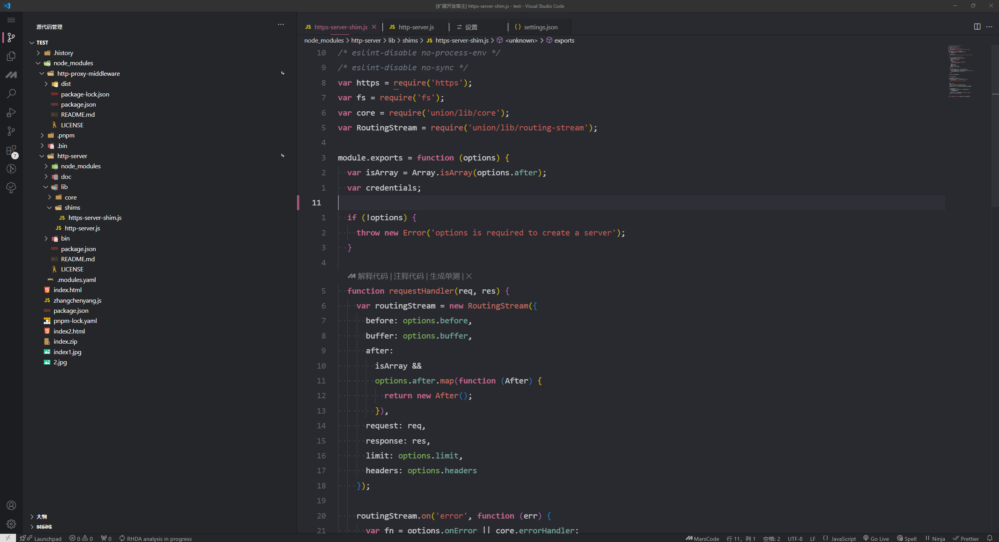
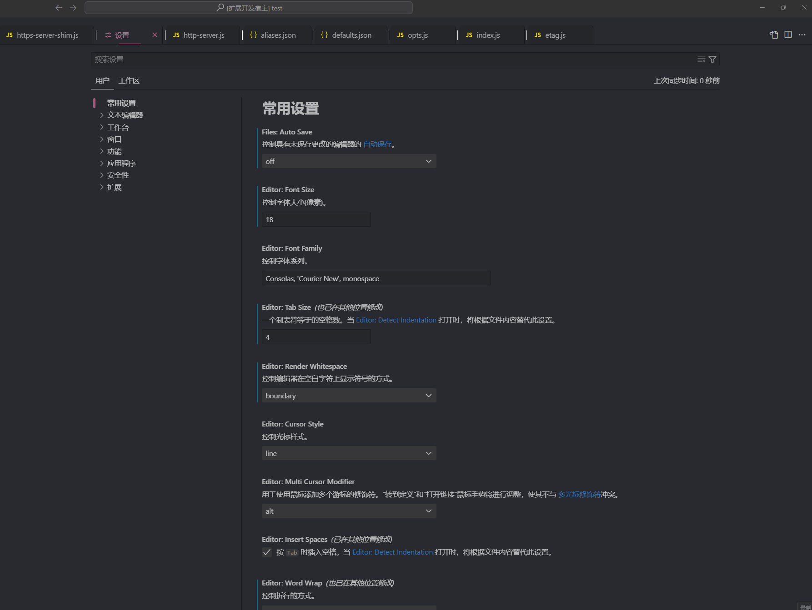

# EasyAnimCode

[中文文档](./README.zh.md)
This English documentation was translated by ChatGPT.

**EasyAnimCode** is an extension that adds animation transitions for daily operations in VSCode.

## Features

-   Adds animation effects to common operations in VSCode.
-   Modifies the basic style of VSCode, bringing a more visually appealing experience.
-   Currently confirmed to support Windows platform only (other platforms not yet tested).
-   **This plugin `v0.0.2` supports VSCode version `1.94`**.

> This plugin has some conflicts with other animation plugins (e.g., VSCode Animations). It is recommended to uninstall or disable other plugins before using this one.

## Installation

1. Run VSCode as an administrator.
2. Download and install EasyAnimCode from the VSCode extension marketplace, or manually install the `.vsix` file.
3. Enable the animation effects by running the command `easy-anim-code.enable` via the VSCode Command Palette (`Ctrl+Shift+P`). After the command executes, reload VSCode to apply the changes.

> After reloading VSCode, you may receive a "corrupt installation" message because the plugin modifies the configuration files. If you do not wish to see this notification again, click the gear icon on the right side of the notification and choose to dismiss it.

## Disabling the Extension

1. Run VSCode as an administrator.
2. Disable the animation effects by running the command `easy-anim-code.disable` via the VSCode Command Palette (`Ctrl+Shift+P`). After the command executes, reload VSCode.

> Disabling the extension will also reset its configuration.

## Reset and Uninstall

Since the plugin modifies VSCode's local configuration files, you need to reset the settings before uninstalling to restore VSCode to its initial state. If you skip the reset step, the original VSCode state will not be restored after uninstalling the extension.
**Note: Uninstalling the extension will not automatically restore VSCode's original state, so please run the reset command before uninstalling.**

1. Run VSCode as an administrator.
2. Run the command `easy-anim-code.reset` via the VSCode Command Palette (`Ctrl+Shift+P`) to reset settings to their default state. After the command executes, reload VSCode.

> **Reset Notice**: If you wish to continue using the plugin after resetting, simply run `easy-anim-code.enable` again.

> Disabling the extension will reset its configuration.

## VSCode Updates

After updating VSCode, you need to run the easy-anim-code.enable command again to enable the animation effects.

## Extension Troubleshooting Guide

If the extension causes issues and damages VSCode's configuration files, you can try the following steps to repair the local files:

#### Repair Steps for Windows Users

#### VSCode 1.94 Version Repair Process

1. Go to the VSCode installation directory.
2. Locate the `resources\app\out\vs\code\electron-sandbox\workbench` folder.
3. Find the files `workbench.esm.html` .
4. Replace the content of these files with the templates provided below. After saving the changes, restart VSCode.

#### `workbench.esm.html` Template

```html
<!-- Copyright (C) Microsoft Corporation. All rights reserved. -->
<!DOCTYPE html>
<html>
    <head>
        <meta charset="utf-8" />
        <meta
            http-equiv="Content-Security-Policy"
            content="
				default-src
					'none'
				;
				img-src
					'self'
					data:
					blob:
					vscode-remote-resource:
					vscode-managed-remote-resource:
					https:
				;
				media-src
					'self'
				;
				frame-src
					'self'
					vscode-webview:
				;
				script-src
					'self'
					'unsafe-eval'
					blob:
				;
				style-src
					'self'
					'unsafe-inline'
				;
				connect-src
					'self'
					https:
					ws:
				;
				font-src
					'self'
					vscode-remote-resource:
					vscode-managed-remote-resource:
					https://*.vscode-unpkg.net
				;
				require-trusted-types-for
					'script'
				;
				trusted-types
					amdLoader
					cellRendererEditorText
					defaultWorkerFactory
					diffEditorWidget
					diffReview
					domLineBreaksComputer
					dompurify
					editorGhostText
					editorViewLayer
					notebookRenderer
					stickyScrollViewLayer
					tokenizeToString
				;
		" />
    </head>

    <body aria-label=""></body>

    <!-- Startup (do not modify order of script tags!) -->
    <script
        src="./workbench.js"
        type="module"></script>
</html>
```

**If the above methods don't work, please try reinstalling VSCode.**

## Configuration Options

To avoid conflicts with users' theme plugins, EasyAnimCode provides several configuration options that allow users to customize the plugin settings as needed.

-   `Easy-anim-code.Primary Color`: Sets the primary color of the plugin.
-   `Easy-anim-code.Anim Level`: Sets the level of animation effects.
-   `Easy-anim-code.Background Image`: Sets the global background image.
-   `Easy-anim-code.Background Image Blur`: Adjusts the Gaussian blur level of the background image.
-   `Easy-anim-code.Terminal Animation`: Enables or disables terminal animations.
-   `Easy-anim-code.VSCode Background Opacity`: Adjusts the opacity of the global background.

> The path should be an absolute path, and Windows platform paths require escaping, e.g., `"C:\\luoqixi\\0614_11.png"`. Image paths with Chinese characters are not supported.

> Only PNG images are supported. Please choose an image that fits your screen resolution. If the image is too small, the visual experience may be unsatisfactory.

> Configuration values must use hexadecimal color codes, and transparency is supported. If you modify the configuration, you need to run `easy-anim-code.disable` first, then run `easy-anim-code.enable` and restart VSCode to apply the changes.

**Please note: Every time you run the `easy-anim-code.disable` command, the configuration will be reset to the default value.**

## Installing Other Versions to Support Lower Versions of VSCode

| Plugin Version | Corresponding VSCode Version | Installation                                                                                                                            | Documentation                                                                        |
| -------------- | ---------------------------- | --------------------------------------------------------------------------------------------------------------------------------------- | ------------------------------------------------------------------------------------ |
| v0.0.6         | 1.94+                        | Latest                                                                                                                                  | Latest                                                                               |
| v0.0.5         | 1.94+                        | [Link](https://github.com/XiaMi-Long/VS-Code-EasyAnimCode/releases/tag/v0.0.5) - Simply drag the visx package into VSCode               | [Link](https://github.com/XiaMi-Long/VS-Code-EasyAnimCode/tree/v0.0.5)               |
| v0.0.4         | 1.94+                        | [Link](https://github.com/XiaMi-Long/VS-Code-EasyAnimCode/releases/tag/v0.04-vscode_1.94%2B) - Simply drag the visx package into VSCode | [Link](https://github.com/XiaMi-Long/VS-Code-EasyAnimCode/tree/v0.04-vscode_1.94%2B) |
| v0.0.3         | 1.94+                        | [Link](https://github.com/XiaMi-Long/VS-Code-EasyAnimCode/releases/tag/v0.0.3-vscode_1.94) - Simply drag the visx package into VSCode   | [Link](https://github.com/XiaMi-Long/VS-Code-EasyAnimCode/tree/v0.0.3-vscode_1.94)   |
| v0.0.2         | 1.94+                        | [Link](https://github.com/XiaMi-Long/VS-Code-EasyAnimCode/releases/tag/v1.94.0) - Simply drag the visx package into VSCode              | [Link](https://github.com/XiaMi-Long/VS-Code-EasyAnimCode/tree/v1.94.0)              |
| v0.0.1         | 1.93                         | [Link](https://github.com/XiaMi-Long/VS-Code-EasyAnimCode/releases/tag/v1.93.0%2B) - Simply drag the visx package into VSCode           | [Link](https://github.com/XiaMi-Long/VS-Code-EasyAnimCode/tree/v1.93.0%2B)           |

## Acknowledgments

Special thanks to the following plugins and CSS libraries for their inspiration and help in creating this project:

-   [Fluent UI for VSCode](https://marketplace.visualstudio.com/items?itemName=leandro-rodrigues.fluent-ui-vscode)
-   [Apc Customize UI++ ](https://marketplace.visualstudio.com/items?itemName=drcika.apc-extension)
-   [Animista](https://animista.net/play)

The creation of this plugin would not have been possible without the contributions of the above projects!

## Interface Preview


> Theme: [Monokai Nocturne](https://marketplace.visualstudio.com/items?itemName=wwy.monokai-nocturne)


> Theme: [Rainglow-Absent Contrast](https://marketplace.visualstudio.com/items?itemName=daylerees.rainglow)



> Theme: [XCode-default](https://marketplace.visualstudio.com/items?itemName=smockle.xcode-default-theme)

##### Sidebar


#### Extension Page


#### Editor Page


#### Context Menu


#### Command Palette


#### Search


#### Settings



#### Code


#### Notifications


### Easy-anim-code.AnimLevel set to High

#### Lists


### BackgroundImage


### 常见问题解决

#### The plugin has already been executed, execution is terminated this time

Simply execute the "disabled" command once, then run the "enable" command again.

#### 更新 "Easy Anim Code"扩展时出错。

This issue is usually not caused by the plugin itself. Please try uninstalling and then reinstalling the plugin.

#### The execution encountered an exception.

This indicates an internal exception within the plugin. Please carefully check if your custom configuration parameters are correct.
