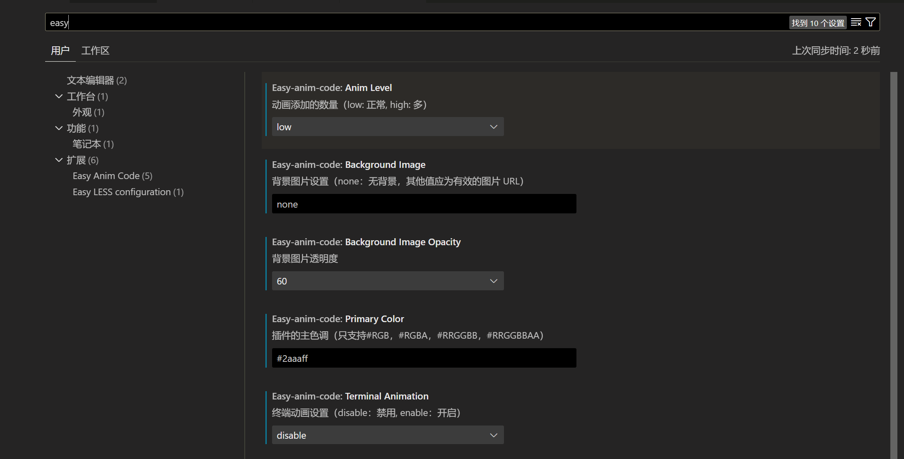
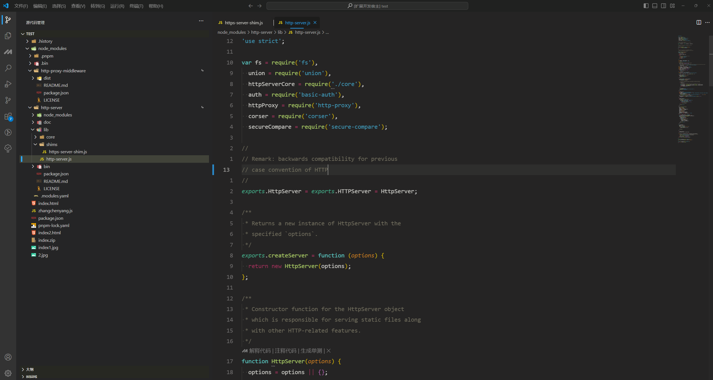
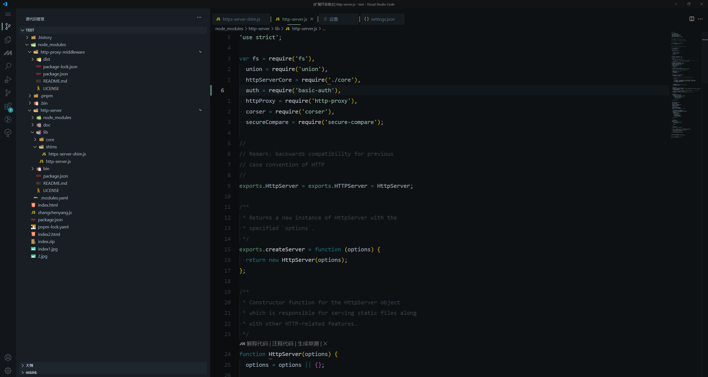
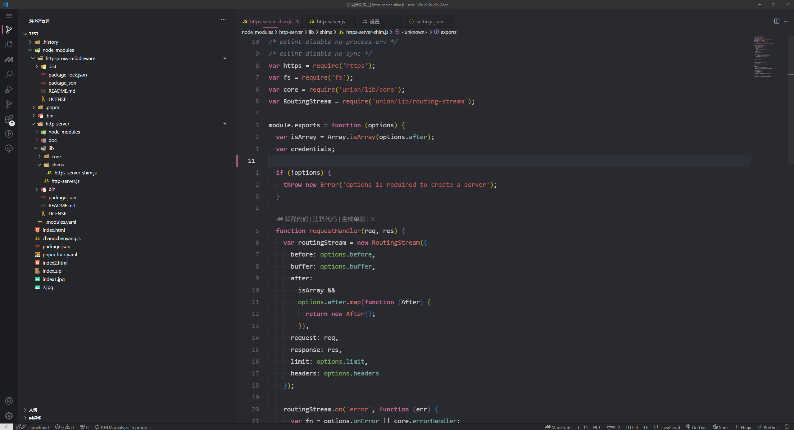
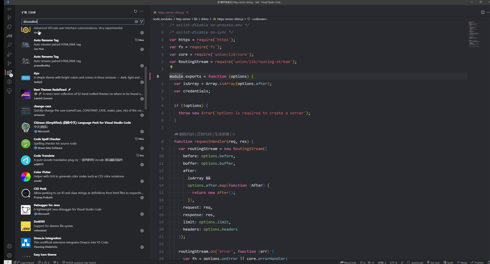
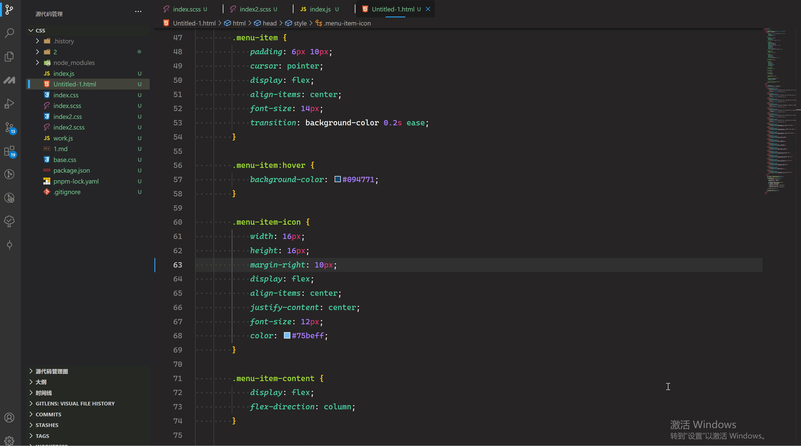
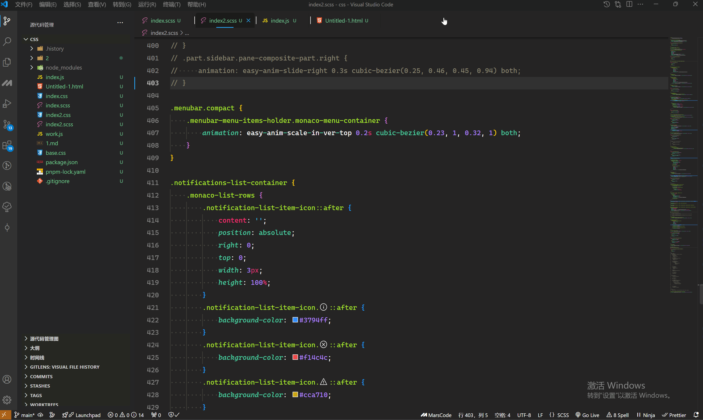
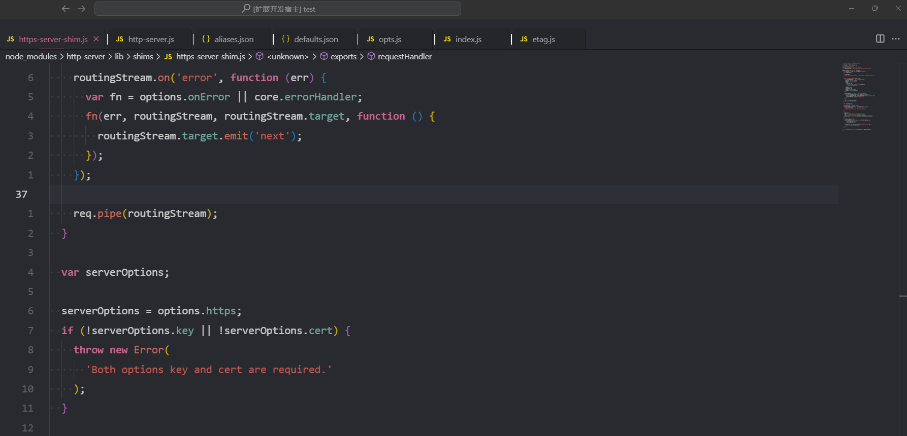
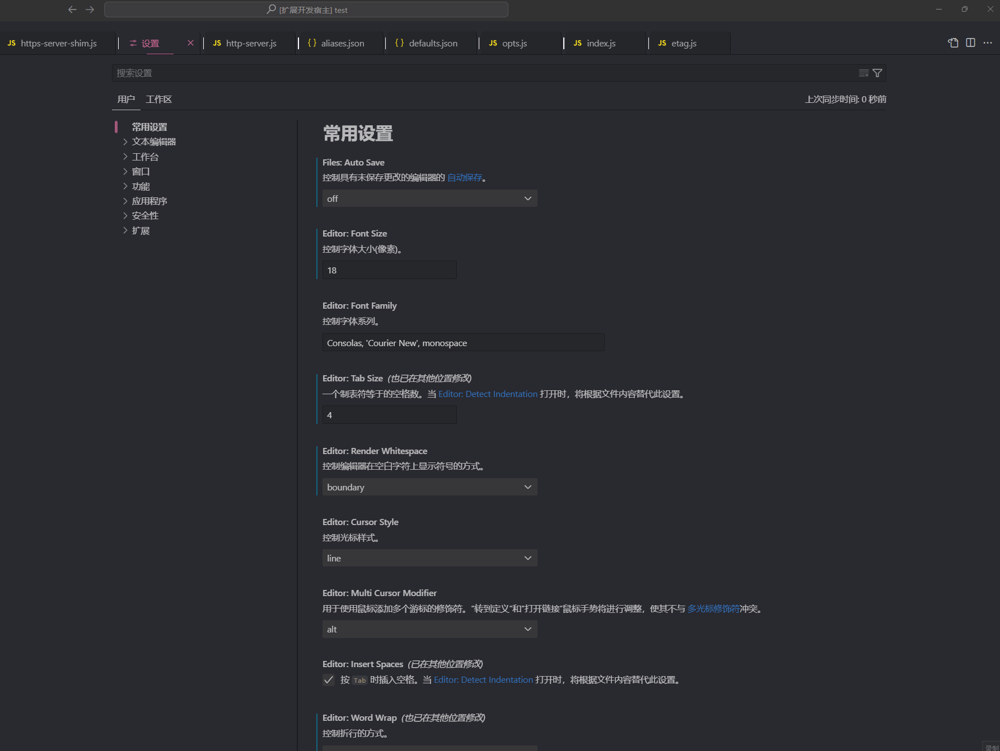
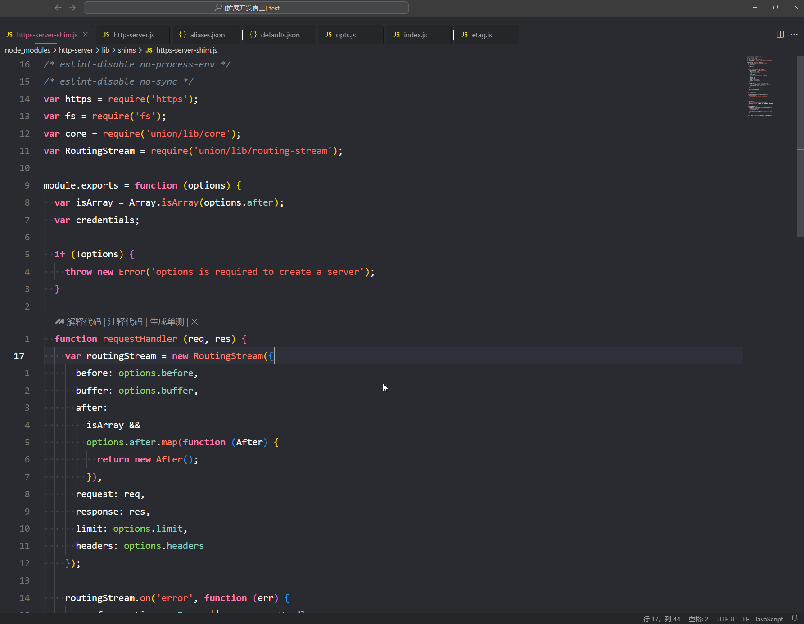

# EasyAnimCode

[English Documentation](./README.en.md)

**EasyAnimCode** 是一个为 VSCode 添加日常操作动画过渡的扩展。

## 功能

-   为 VSCode 的常见操作添加动画效果。
-   修改 VSCode 的基础样式，带来更美观的视觉体验。
-   目前仅确定支持 Windows 平台（其他平台尚未测试）。
-   推荐 VSCode 版本 `1.93` 及以上。

## 安装

1. 以管理员身份运行 VSCode。
2. 从 VSCode 扩展市场下载并安装 EasyAnimCode，或手动安装 `.vsix` 文件。
3. 通过 VSCode 命令面板（按 `Ctrl+Shift+P`）执行 `easy-anim-code.enable` 命令启用动画效果。执行完毕后，重新加载 VSCode 以应用更改。

> 重新加载 VSCode 后，可能会提示“安装已损坏”，这是由于插件修改了配置文件。若不想再看到此通知，可以点击通知右侧齿轮图标，选择不再显示。

## 禁用插件

1. 以管理员身份运行 VSCode。
2. 通过 VSCode 命令面板（按 `Ctrl+Shift+P`）执行 `easy-anim-code.disable` 命令禁用动画效果。执行完毕后，重新加载 VSCode。

> 禁用插件的同时，会重置插件的配置

## 重置和卸载

因为插件会修改 VSCode 的本地配置文件，若需恢复 VSCode 的初始状态，请按照以下步骤重置设置： 卸载扩展前，务必执行重置操作，否则 VSCode 状态不会自动恢复。
**注意：卸载插件不会自动恢复 VSCode 原有状态，卸载前请先执行重置命令。**

1. 以管理员身份运行 VSCode。
2. 通过 VSCode 命令面板（按 `Ctrl+Shift+P`）执行 `easy-anim-code.reset` 命令将设置重置为默认状态。执行完毕后，重新加载 VSCode。

> **重置注意**：重置注意：重置后若想继续使用插件，只需再次执行 easy-anim-code.enable。

> 禁用插件的同时，会重置插件的配置

## VSCode 更新

VSCode 更新之后，需要重新执行 `easy-anim-code.enable` 命令启用动画效果。

## 插件错误修复指南

如果插件出现问题，可能会损坏 VSCode 的配置文件。你可以尝试以下步骤修复本地文件：

#### Windows 用户修复步骤

1. 进入 VSCode 安装目录。
2. 找到 `resources\app\out\vs\code\electron-sandbox\workbench` 文件夹。
3. 找到 `workbench.html` 和 `workbench-apc-extension.html` 两个文件。
4. 使用下面提供的模板替换这两个文件中的内容，保存修改后重新启动 VSCode。

##### `workbench.html` 模板

```html
<!-- Copyright (C) Microsoft Corporation. All rights reserved. -->
<!DOCTYPE html>
<html>
    <head>
        <meta charset="utf-8" />
        <meta
            http-equiv="Content-Security-Policy"
            content="
                default-src 'none';
                img-src 'self' data: blob: vscode-remote-resource: vscode-managed-remote-resource: https:;
                media-src 'self';
                frame-src 'self' vscode-webview:;
                script-src 'self' 'unsafe-eval' blob:;
                style-src 'self' 'unsafe-inline';
                connect-src 'self' https: ws:;
                font-src 'self' vscode-remote-resource: vscode-managed-remote-resource: https://*.vscode-unpkg.net;
                require-trusted-types-for 'script';
                trusted-types
                    amdLoader
                    cellRendererEditorText
                    defaultWorkerFactory
                    diffEditorWidget
                    diffReview
                    domLineBreaksComputer
                    dompurify
                    editorGhostText
                    editorViewLayer
                    notebookRenderer
                    stickyScrollViewLayer
                    tokenizeToString;
            " />
    </head>

    <body aria-label=""></body>
    <!-- Startup (do not modify order of script tags !) -->
    <script src="workbench.js"></script>
</html>
```

##### `workbench-apc-extension.html` 模板

```html
<!DOCTYPE html>
<html>
    <head>
        <meta charset="utf-8" />
    </head>

    <body aria-label=""></body>
    <!-- Startup (do not modify order of script tags!) -->
    <script src="../../../patch/browser.main.js"></script>
    <script src="workbench.js"></script>
</html>
```

**如以上方法无效，请尝试重新安装 VSCode。**

## 配置选项

为避免与用户的主题插件发生冲突，EasyAnimCode 提供了一些可配置项，用户可以根据需要自定义插件设置。

> 考虑到不同用户使用的主题插件不同，如果直接使用默认插件，可能于用户的主题有颜色和样式的冲突。



-   `Easy-anim-code.PrimaryColor`: 设置插件的主色调。
-   `Easy-anim-code.AnimLevel`: 设置动画效果的级别。

> 配置值需使用 16 进制颜色代码，支持透明度设置。若修改配置，需先执行 easy-anim-code.disable，再运行 easy-anim-code.enable 并重启 VSCode 以应用更改。

**请注意：每次运行 `easy-anim-code.disable` 命令之后，配置会被重置为默认值。**

## 致谢

在此特别感谢以下插件和 CSS 库对本项目的启发和帮助：

-   [Fluent UI for VSCode](https://marketplace.visualstudio.com/items?itemName=leandro-rodrigues.fluent-ui-vscode)
-   [Apc Customize UI++ ](https://marketplace.visualstudio.com/items?itemName=drcika.apc-extension)
-   [Animista](https://animista.net/play)

本插件的创建，离不开上述插件的贡献！

## 界面预览



> 主题：[Monokai Nocturne](https://marketplace.visualstudio.com/items?itemName=wwy.monokai-nocturne)



> 主题：[Rainglow-Absent Contrast](https://marketplace.visualstudio.com/items?itemName=daylerees.rainglow)



> 主题：[XCode-default](https://marketplace.visualstudio.com/items?itemName=smockle.xcode-default-theme)

##### 侧边栏


#### 扩展页面



#### 编辑页面



#### 右键菜单



#### 命令弹窗


#### 搜索



#### 设置



#### Code


#### 通知



### Easy-anim-code.AnimLevel 更改为 High

#### 列表


## 已知问题

-   **终端偏移**：终端输入框会偏下，具体表现与显示器分辨率相关。临时解决方案：
    1. 微调终端高度，使 VSCode 自动重新计算。
    2. 切换到端口选项卡，再切换回终端。
-   **扩展详情页面动画**：目前仅第一个扩展详情页面有动画效果，下个版本将修复此问题。
