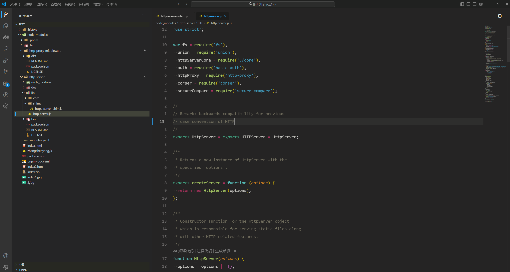
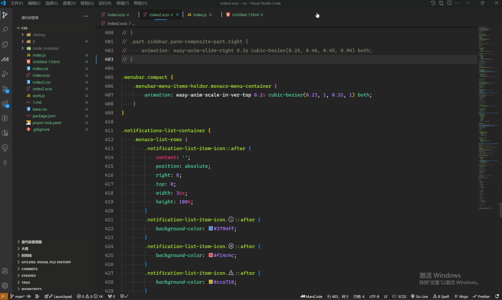
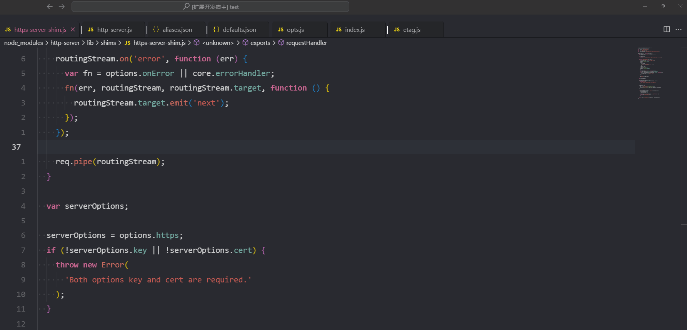
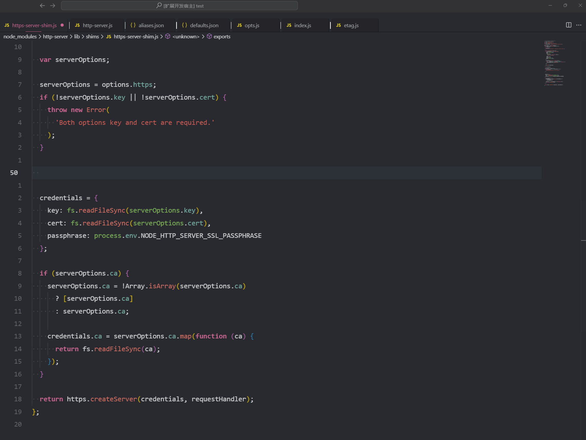

# EasyAnimCode

[English Documentation](./README.md)

**EasyAnimCode** 是一个为 VSCode 添加日常操作动画过渡的扩展。

## 功能

-   为 VSCode 的常见操作添加动画效果。
-   修改 VSCode 的基础样式，带来更美观的视觉体验。
-   为 VSCode 添加透明背景
-   目前仅确定支持 Windows 平台（其他平台尚未测试）。
-   **本插件 `v0.0.2` 支持 VSCode 版本 `1.94`**。

> 本插件与其他动画插件有一定的冲突（比如：VSCode Animations），建议在使用本插件前先卸载或者禁用其他插件。

## 安装

1. 以管理员身份运行 VSCode。
2. 从 VSCode 扩展市场下载并安装 EasyAnimCode，或手动安装 `.vsix` 文件。
3. 通过 VSCode 命令面板（按 `Ctrl+Shift+P`）执行 `easy-anim-code.enable` 命令启用动画效果。执行完毕后，重新加载 VSCode 以应用更改。

> 重新加载 VSCode 后，可能会提示“安装已损坏”，这是由于插件修改了配置文件。若不想再看到此通知，可以点击通知右侧齿轮图标，选择不再显示。

## 禁用插件

1. 以管理员身份运行 VSCode。
2. 通过 VSCode 命令面板（按 `Ctrl+Shift+P`）执行 `easy-anim-code.disable` 命令禁用动画效果。执行完毕后，重新加载 VSCode。

> 禁用插件的同时，会重置插件的配置

## 重置和卸载

因为插件会修改 VSCode 的本地配置文件，若需恢复 VSCode 的初始状态，请按照以下步骤重置设置： 卸载扩展前，务必执行重置操作，否则 VSCode 状态不会自动恢复。
**注意：卸载插件不会自动恢复 VSCode 原有状态，卸载前请先执行重置命令。**

1. 以管理员身份运行 VSCode。
2. 通过 VSCode 命令面板（按 `Ctrl+Shift+P`）执行 `easy-anim-code.reset` 命令将设置重置为默认状态。执行完毕后，重新加载 VSCode。

> **重置注意**：重置注意：重置后若想继续使用插件，只需再次执行 easy-anim-code.enable。

> 禁用插件的同时，会重置插件的配置

## VSCode 更新

VSCode 更新之后，需要重新执行 `easy-anim-code.enable` 命令启用动画效果。

## 插件错误修复指南

如果插件出现问题，可能会损坏 VSCode 的配置文件。你可以尝试以下步骤修复本地文件：

#### Windows 用户修复步骤

#### VSCode 1.94 版本修复流程

1. 进入 VSCode 安装目录。
2. 找到 `resources\app\out\vs\code\electron-sandbox\workbench` 文件夹。
3. 找到 `workbench.esm.html` 文件。
4. 使用下面提供的模板替换这个文件中的内容，保存修改后重新启动 VSCode。

#### `workbench.esm.html` 模板

```html
<!-- Copyright (C) Microsoft Corporation. All rights reserved. -->
<!DOCTYPE html>
<html>
    <head>
        <meta charset="utf-8" />
        <meta
            http-equiv="Content-Security-Policy"
            content="
				default-src
					'none'
				;
				img-src
					'self'
					data:
					blob:
					vscode-remote-resource:
					vscode-managed-remote-resource:
					https:
				;
				media-src
					'self'
				;
				frame-src
					'self'
					vscode-webview:
				;
				script-src
					'self'
					'unsafe-eval'
					blob:
				;
				style-src
					'self'
					'unsafe-inline'
				;
				connect-src
					'self'
					https:
					ws:
				;
				font-src
					'self'
					vscode-remote-resource:
					vscode-managed-remote-resource:
					https://*.vscode-unpkg.net
				;
				require-trusted-types-for
					'script'
				;
				trusted-types
					amdLoader
					cellRendererEditorText
					defaultWorkerFactory
					diffEditorWidget
					diffReview
					domLineBreaksComputer
					dompurify
					editorGhostText
					editorViewLayer
					notebookRenderer
					stickyScrollViewLayer
					tokenizeToString
				;
		" />
    </head>

    <body aria-label=""></body>

    <!-- Startup (do not modify order of script tags!) -->
    <script
        src="./workbench.js"
        type="module"></script>
</html>
```

**如以上方法无效，请尝试重新安装 VSCode。**

## 配置选项

为避免与用户的主题插件发生冲突，EasyAnimCode 提供了一些可配置项，用户可以根据需要自定义插件设置。

-   `Easy-anim-code.Primary Color`: 设置插件的主色调。
-   `Easy-anim-code.Anim Level`: 设置动画效果的级别。
-   `Easy-anim-code.Background Image`: 设置全局背景图片。
-   `Easy-anim-code.Background Image Blur`: 调整背景图片的高斯模糊度。
-   `Easy-anim-code.Terminal Animation`: 设置终端动画的开启和关闭。
-   `Easy-anim-code.VSCode Background Opacity`: 调整全局背景的透明度。

> 路径为绝对路径，window 平台路径需要转义，例："C:\\luoqixi\\0614_11.png" 图片路径不支持有中文

> 图片只支持 png，请尽量选合适自己屏幕分辨率的图片，图片过小，观感不佳

> 配置值需使用 16 进制颜色代码，支持透明度设置。若修改配置，需先执行 easy-anim-code.disable，再运行 easy-anim-code.enable 并重启 VSCode 以应用更改。

**请注意：每次运行 `easy-anim-code.disable` 命令之后，配置会被重置为默认值。**

## 安装其他版本，以支持更低版本的 VSCode

| 插件版本 | 对应 VSCode 版本 | 安装                                                                                                                       | 文档                                                                                 |
| -------- | ---------------- | -------------------------------------------------------------------------------------------------------------------------- | ------------------------------------------------------------------------------------ |
| v0.0.6   | 1.94+            | 最新                                                                                                                       | 最新                                                                                 |
| v0.0.5   | 1.94+            | [链接](https://github.com/XiaMi-Long/VS-Code-EasyAnimCode/releases/tag/v0.0.5) 安装包直接拖入 VSCode 即可                  | [链接](https://github.com/XiaMi-Long/VS-Code-EasyAnimCode/tree/v0.0.5)               |
| v0.0.4   | 1.94+            | [链接](https://github.com/XiaMi-Long/VS-Code-EasyAnimCode/releases/tag/v0.04-vscode_1.94%2B) 安装包直接拖入 VSCode 即可    | [链接](https://github.com/XiaMi-Long/VS-Code-EasyAnimCode/tree/v0.04-vscode_1.94%2B) |
| v0.0.3   | 1.94+            | [链接](https://github.com/XiaMi-Long/VS-Code-EasyAnimCode/releases/tag/v0.0.3-vscode_1.94) visx 安装包直接拖入 VSCode 即可 | [链接](https://github.com/XiaMi-Long/VS-Code-EasyAnimCode/tree/v0.0.3-vscode_1.94)   |
| v0.0.2   | 1.94             | [链接](https://github.com/XiaMi-Long/VS-Code-EasyAnimCode/releases/tag/v1.94.0) visx 安装包直接拖入 VSCode 即可            | [链接](https://github.com/XiaMi-Long/VS-Code-EasyAnimCode/tree/v1.94.0)              |
| v0.0.1   | 1.93             | [链接](https://github.com/XiaMi-Long/VS-Code-EasyAnimCode/releases/tag/v1.93.0%2B) visx 安装包直接拖入 VSCode 即可         | [链接](https://github.com/XiaMi-Long/VS-Code-EasyAnimCode/tree/v1.93.0%2B)           |

## 致谢

在此特别感谢以下插件和 CSS 库对本项目的启发和帮助：

-   [Fluent UI for VSCode](https://marketplace.visualstudio.com/items?itemName=leandro-rodrigues.fluent-ui-vscode)
-   [Apc Customize UI++ ](https://marketplace.visualstudio.com/items?itemName=drcika.apc-extension)
-   [Animista](https://animista.net/play)

本插件的创建，离不开上述插件的贡献！

## 界面预览



> 主题：[Monokai Nocturne](https://marketplace.visualstudio.com/items?itemName=wwy.monokai-nocturne)


> 主题：[Rainglow-Absent Contrast](https://marketplace.visualstudio.com/items?itemName=daylerees.rainglow)


> 主题：[XCode-default](https://marketplace.visualstudio.com/items?itemName=smockle.xcode-default-theme)

##### 侧边栏


#### 扩展页面


#### 编辑页面


#### 右键菜单



#### 命令弹窗


#### 搜索



#### 设置


#### Code



#### 通知


### Easy-anim-code.AnimLevel 更改为 High

#### 列表


### 背景图片


### 常见问题解决

#### 插件已执行过，本次中止执行

此问题只需要执行一遍 disabled 命令即可，然后再运行 enable 命令即可。

#### 更新 "Easy Anim Code"扩展时出错。

此类问题一遍不是插件的问题，请尝试卸载插件，然后重新安装插件

#### 执行出现异常

此问题是插件内部执行出现异常，请仔细核对你自定义的配置参数是否规范
